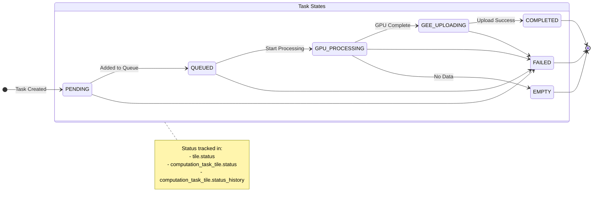

```mermaid
    stateDiagram-v2
    direction LR
    
    [*] --> PENDING: Task Created
    
    state "Task States" as TaskStates {
        PENDING --> QUEUED: Added to Queue
        QUEUED --> GPU_PROCESSING: Start Processing
        GPU_PROCESSING --> GEE_UPLOADING: GPU Complete
        GEE_UPLOADING --> COMPLETED: Upload Success
        
        PENDING --> FAILED
        QUEUED --> FAILED
        GPU_PROCESSING --> FAILED
        GEE_UPLOADING --> FAILED
        
        GPU_PROCESSING --> EMPTY: No Data
    }
    
    COMPLETED --> [*]
    FAILED --> [*]
    EMPTY --> [*]
    
    note right of TaskStates
        Status tracked in:
        - tile.status
        - computation_task_tile.status
        - computation_task_tile.status_history
    end note

```