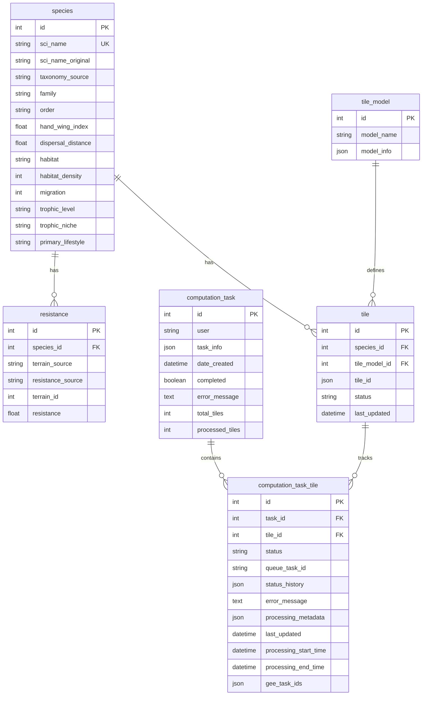

```mermaid
    erDiagram
    species ||--o{ resistance : "has"
    species ||--o{ tile : "has"
    tile_model ||--o{ tile : "defines"
    computation_task ||--o{ computation_task_tile : "contains"
    tile ||--o{ computation_task_tile : "tracks"
    
    species {
        int id PK
        string sci_name UK
        string sci_name_original
        string taxonomy_source
        string family
        string order
        float hand_wing_index
        float dispersal_distance
        string habitat
        int habitat_density
        int migration
        string trophic_level
        string trophic_niche
        string primary_lifestyle
    }
    
    resistance {
        int id PK
        int species_id FK
        string terrain_source
        string resistance_source
        int terrain_id
        float resistance
    }
    
    tile_model {
        int id PK
        string model_name
        json model_info
    }
    
    tile {
        int id PK
        int species_id FK
        int tile_model_id FK
        json tile_id
        string status
        datetime last_updated
    }
    
    computation_task {
        int id PK
        string user
        json task_info
        datetime date_created
        boolean completed
        text error_message
        int total_tiles
        int processed_tiles
    }
    
    computation_task_tile {
        int id PK
        int task_id FK
        int tile_id FK
        string status
        string queue_task_id
        json status_history
        text error_message
        json processing_metadata
        datetime last_updated
        datetime processing_start_time
        datetime processing_end_time
        json gee_task_ids
    }
```