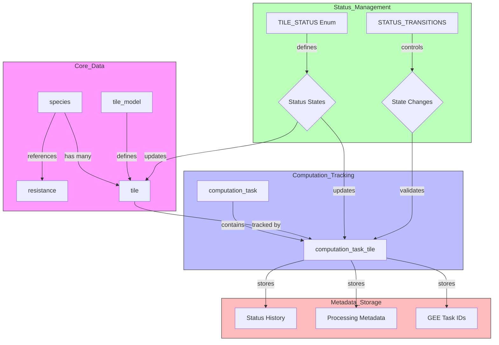

```mermaid
flowchart TD
    subgraph Core_Data
        A[species] -->|references| B[resistance]
        A -->|has many| C[tile]
        D[tile_model] -->|defines| C
    end
    
    subgraph Computation_Tracking
        E[computation_task] -->|contains| F[computation_task_tile]
        C -->|tracked by| F
    end
    
    subgraph Status_Management
        G[TILE_STATUS Enum] -->|defines| H{Status States}
        H -->|updates| C
        H -->|updates| F
        
        I[STATUS_TRANSITIONS] -->|controls| J{State Changes}
        J -->|validates| F
    end
    
    subgraph Metadata_Storage
        F -->|stores| K[Status History]
        F -->|stores| L[Processing Metadata]
        F -->|stores| M[GEE Task IDs]
    end
    
    style Core_Data fill:#f9f,stroke:#333
    style Computation_Tracking fill:#bbf,stroke:#333
    style Status_Management fill:#bfb,stroke:#333
    style Metadata_Storage fill:#fbb,stroke:#333
```