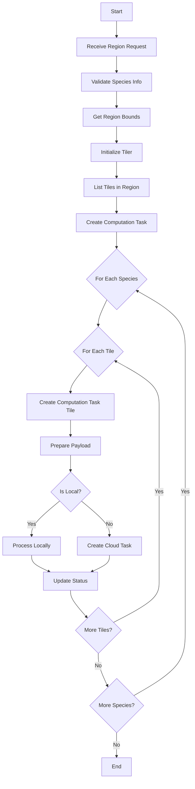

```mermaid
    flowchart TD
    A[Start] --> B[Receive Region Request]
    B --> C[Validate Species Info]
    C --> D[Get Region Bounds]
    D --> E[Initialize Tiler]
    E --> F[List Tiles in Region]
    
    F --> G[Create Computation Task]
    G --> H{For Each Species}
    H --> I{For Each Tile}
    
    I --> J[Create Computation Task Tile]
    J --> K[Prepare Payload]
    
    K --> L{Is Local?}
    L -->|Yes| M[Process Locally]
    L -->|No| N[Create Cloud Task]
    
    M --> O[Update Status]
    N --> O
    
    O --> P{More Tiles?}
    P -->|Yes| I
    P -->|No| Q{More Species?}
    Q -->|Yes| H
    Q -->|No| R[End]
```