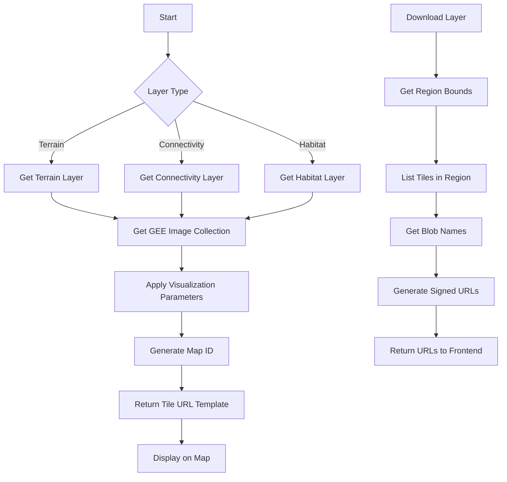

```mermaid
    flowchart TD
    A[Start] --> B{Layer Type}
    
    B -->|Terrain| C[Get Terrain Layer]
    B -->|Connectivity| D[Get Connectivity Layer]
    B -->|Habitat| E[Get Habitat Layer]
    
    C --> F[Get GEE Image Collection]
    D --> F
    E --> F
    
    F --> G[Apply Visualization Parameters]
    G --> H[Generate Map ID]
    H --> I[Return Tile URL Template]
    I --> J[Display on Map]
    
    K[Download Layer] --> L[Get Region Bounds]
    L --> M[List Tiles in Region]
    M --> N[Get Blob Names]
    N --> O[Generate Signed URLs]
    O --> P[Return URLs to Frontend]
```