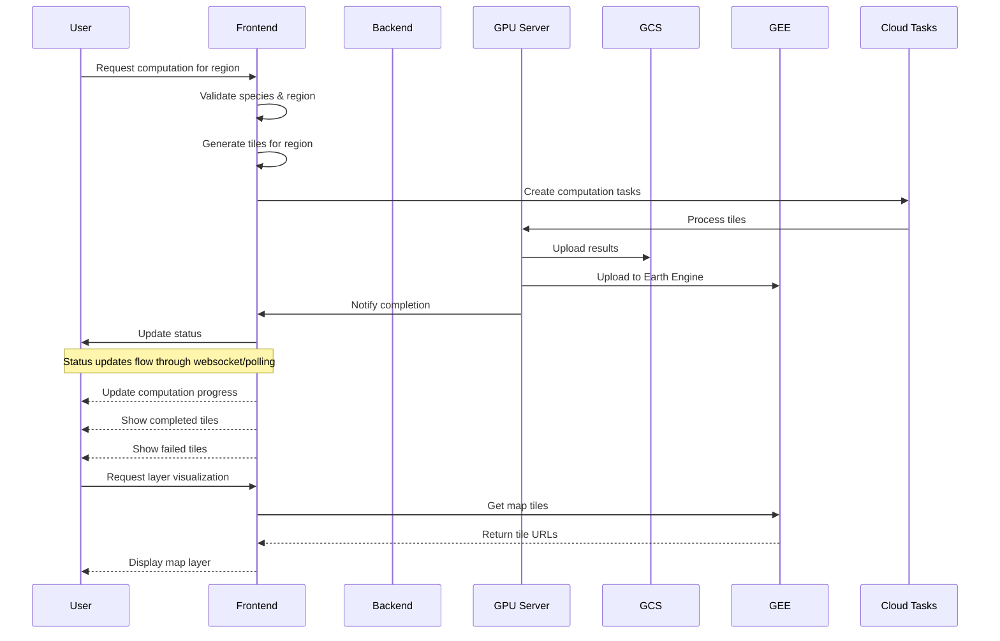

```mermaid
sequenceDiagram
    participant User
    participant Frontend
    participant Backend
    participant GPU Server
    participant GCS
    participant GEE
    participant Cloud Tasks

    %% Main Computation Flow
    User->>Frontend: Request computation for region
    Frontend->>Frontend: Validate species & region
    Frontend->>Frontend: Generate tiles for region
    Frontend->>Cloud Tasks: Create computation tasks
    Cloud Tasks->>GPU Server: Process tiles
    GPU Server->>GCS: Upload results
    GPU Server->>GEE: Upload to Earth Engine
    GPU Server->>Frontend: Notify completion
    Frontend->>User: Update status

    %% Status Updates
    Note over Frontend,User: Status updates flow through websocket/polling
    Frontend-->>User: Update computation progress
    Frontend-->>User: Show completed tiles
    Frontend-->>User: Show failed tiles

    %% Layer Visualization
    User->>Frontend: Request layer visualization
    Frontend->>GEE: Get map tiles
    GEE-->>Frontend: Return tile URLs
    Frontend-->>User: Display map layer
```