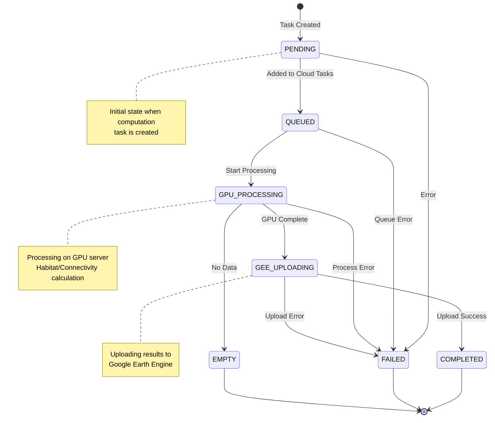

```mermaid
    stateDiagram-v2
    [*] --> PENDING: Task Created
    PENDING --> QUEUED: Added to Cloud Tasks
    QUEUED --> GPU_PROCESSING: Start Processing
    GPU_PROCESSING --> GEE_UPLOADING: GPU Complete
    GEE_UPLOADING --> COMPLETED: Upload Success
    
    PENDING --> FAILED: Error
    QUEUED --> FAILED: Queue Error
    GPU_PROCESSING --> FAILED: Process Error
    GEE_UPLOADING --> FAILED: Upload Error
    
    GPU_PROCESSING --> EMPTY: No Data
    
    COMPLETED --> [*]
    FAILED --> [*]
    EMPTY --> [*]

    note right of PENDING
        Initial state when computation
        task is created
    end note

    note right of GPU_PROCESSING
        Processing on GPU server
        Habitat/Connectivity calculation
    end note

    note right of GEE_UPLOADING
        Uploading results to
        Google Earth Engine
    end note
```