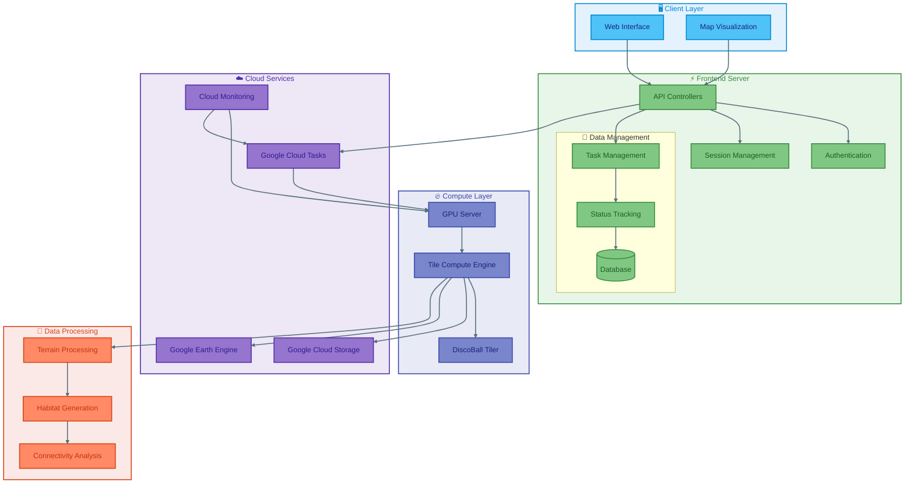

```mermaid
    flowchart TD
    subgraph Client_Layer["🖥️ Client Layer"]
        UI[Web Interface]
        Map[Map Visualization]
    end

    subgraph Frontend_Server["⚡ Frontend Server"]
        API[API Controllers]
        Auth[Authentication]
        Session[Session Management]
        
        subgraph Data_Management["💾 Data Management"]
            DB[(Database)]
            StatusTracker[Status Tracking]
            TaskManager[Task Management]
        end
    end

    subgraph Compute_Layer["🔥 Compute Layer"]
        GPU[GPU Server]
        TileEngine[Tile Compute Engine]
        DiscoTiler[DiscoBall Tiler]
    end

    subgraph Cloud_Services["☁️ Cloud Services"]
        CloudTasks[Google Cloud Tasks]
        GCS[Google Cloud Storage]
        GEE[Google Earth Engine]
        Monitoring[Cloud Monitoring]
    end

    subgraph Data_Types["🔄 Data Processing"]
        Terrain[Terrain Processing]
        Habitat[Habitat Generation]
        Connectivity[Connectivity Analysis]
    end

    %% Connections
    UI --> API
    Map --> API
    API --> Auth
    API --> Session
    API --> TaskManager
    TaskManager --> StatusTracker
    StatusTracker --> DB
    API --> CloudTasks
    CloudTasks --> GPU
    GPU --> TileEngine
    TileEngine --> DiscoTiler
    TileEngine --> GCS
    TileEngine --> GEE
    TileEngine --> Terrain
    Terrain --> Habitat
    Habitat --> Connectivity
    Monitoring --> GPU
    Monitoring --> CloudTasks

    %% Material Design inspired styling
    classDef clientNode fill:#4fc3f7,stroke:#0288d1,color:#1a237e,stroke-width:2px;
    classDef frontendNode fill:#81c784,stroke:#388e3c,color:#1b5e20,stroke-width:2px;
    classDef computeNode fill:#7986cb,stroke:#3949ab,color:#1a237e,stroke-width:2px;
    classDef cloudNode fill:#9575cd,stroke:#512da8,color:#311b92,stroke-width:2px;
    classDef dataNode fill:#ff8a65,stroke:#d84315,color:#bf360c,stroke-width:2px;

    %% Apply styles to nodes
    class UI,Map clientNode;
    class API,Auth,Session,DB,StatusTracker,TaskManager frontendNode;
    class GPU,TileEngine,DiscoTiler computeNode;
    class CloudTasks,GCS,GEE,Monitoring cloudNode;
    class Terrain,Habitat,Connectivity dataNode;

    %% Subgraph styling with material design colors
    style Client_Layer fill:#e3f2fd,stroke:#0288d1,color:#0288d1,stroke-width:2px;
    style Frontend_Server fill:#e8f5e9,stroke:#388e3c,color:#388e3c,stroke-width:2px;
    style Compute_Layer fill:#e8eaf6,stroke:#3949ab,color:#3949ab,stroke-width:2px;
    style Cloud_Services fill:#ede7f6,stroke:#512da8,color:#512da8,stroke-width:2px;
    style Data_Types fill:#fbe9e7,stroke:#d84315,color:#d84315,stroke-width:2px;

    %% Material design link styling
    linkStyle default stroke:#546e7a,stroke-width:2px;
```