# Ecoscape-Architecture
Provides the current Ecoscape Browser Designs, HLD &amp; LLD


# Ecoscape Architecture Documentation


> Comprehensive architecture and design documentation for the Ecoscape Browser system

## 📊 High Level Architecture

```mermaid
flowchart TD
    subgraph Client_Layer["🖥️ Client Layer"]
        UI[Web Interface]
        Map[Map Visualization]
    end

    subgraph Frontend_Server["⚡ Frontend Server"]
        API[API Controllers]
        Auth[Authentication]
        Session[Session Management]
        
        subgraph Data_Management["💾 Data Management"]
            DB[(Database)]
            StatusTracker[Status Tracking]
            TaskManager[Task Management]
        end
    end

    subgraph Compute_Layer["🔥 Compute Layer"]
        GPU[GPU Server]
        TileEngine[Tile Compute Engine]
        DiscoTiler[DiscoBall Tiler]
    end

    subgraph Cloud_Services["☁️ Cloud Services"]
        CloudTasks[Google Cloud Tasks]
        GCS[Google Cloud Storage]
        GEE[Google Earth Engine]
        Monitoring[Cloud Monitoring]
    end

    subgraph Data_Types["🔄 Data Processing"]
        Terrain[Terrain Processing]
        Habitat[Habitat Generation]
        Connectivity[Connectivity Analysis]
    end

    %% Connections
    UI --> API
    Map --> API
    API --> Auth
    API --> Session
    API --> TaskManager
    TaskManager --> StatusTracker
    StatusTracker --> DB
    API --> CloudTasks
    CloudTasks --> GPU
    GPU --> TileEngine
    TileEngine --> DiscoTiler
    TileEngine --> GCS
    TileEngine --> GEE
    TileEngine --> Terrain
    Terrain --> Habitat
    Habitat --> Connectivity
    Monitoring --> GPU
    Monitoring --> CloudTasks

    %% Material Design inspired styling
    classDef clientNode fill:#4fc3f7,stroke:#0288d1,color:#1a237e,stroke-width:2px;
    classDef frontendNode fill:#81c784,stroke:#388e3c,color:#1b5e20,stroke-width:2px;
    classDef computeNode fill:#7986cb,stroke:#3949ab,color:#1a237e,stroke-width:2px;
    classDef cloudNode fill:#9575cd,stroke:#512da8,color:#311b92,stroke-width:2px;
    classDef dataNode fill:#ff8a65,stroke:#d84315,color:#bf360c,stroke-width:2px;

    %% Apply styles to nodes
    class UI,Map clientNode;
    class API,Auth,Session,DB,StatusTracker,TaskManager frontendNode;
    class GPU,TileEngine,DiscoTiler computeNode;
    class CloudTasks,GCS,GEE,Monitoring cloudNode;
    class Terrain,Habitat,Connectivity dataNode;

    %% Subgraph styling
    style Client_Layer fill:#e3f2fd,stroke:#0288d1,color:#0288d1,stroke-width:2px;
    style Frontend_Server fill:#e8f5e9,stroke:#388e3c,color:#388e3c,stroke-width:2px;
    style Compute_Layer fill:#e8eaf6,stroke:#3949ab,color:#3949ab,stroke-width:2px;
    style Cloud_Services fill:#ede7f6,stroke:#512da8,color:#512da8,stroke-width:2px;
    style Data_Types fill:#fbe9e7,stroke:#d84315,color:#d84315,stroke-width:2px;

    %% Link styling
    linkStyle default stroke:#546e7a,stroke-width:2px;
```



## 🏗 System Components

### 1. Client Layer
- Web Interface for user interactions
- Map Visualization component
- Interactive layer controls
- Data visualization tools

### 2. Frontend Server
- **API Controllers**: Handle incoming requests and data flow
- **Authentication**: User access management
- **Session Management**: User state handling
- **Data Management**:
  - Database operations
  - Status tracking
  - Task management

### 3. Compute Layer
- GPU Server for processing
- Tile Compute Engine
- DiscoBall Tiler for geographic calculations

### 4. Cloud Services
- Google Cloud Tasks: Job queue management
- Google Cloud Storage: Data storage
- Google Earth Engine: Map processing
- Cloud Monitoring: System health tracking

### 5. Data Processing
- Terrain Processing
- Habitat Generation
- Connectivity Analysis

## 📐 Architecture Views

Detailed architecture documentation is organized into the following sections:

- [Database Schema](./Database/README.md)
- [Component Design](./EcoscapeBrowser/README.md)
- [Tile Computation](./TileComputation/README.md)
- [High Level Design](./HLD_Architecture.md)

## 🔄 Data Flow

### Computation Flow
1. User initiates computation request
2. Frontend validates and processes request
3. Task queued for computation
4. GPU server processes tiles
5. Results stored in cloud services
6. Data displayed on map interface

### Visualization Flow
1. User selects layers for visualization
2. System fetches processed data
3. Map renders selected layers
4. Interactive controls modify display

## 🛠 Tech Stack

- **Frontend**: Vue, Google Maps
- **Backend**: Python, py4web
- **Computation**: GPU Processing
- **Storage**: GCS, GEE
- **Queue**: Google Cloud Tasks
- **Database**: MySQL

## 📚 Documentation Structure

```
.
├── Database/               # Database design and schema
├── EcoscapeBrowser/       # Browser component documentation
├── TileComputation/       # Computation engine details
├── HLD_Architecture.md    # High-level design document
└── README.md             # This file
```

## 🚀 Getting Started

For detailed setup and contribution guidelines, please refer to:
- [Development Setup](./EcoscapeBrowser/setup.md)
- [Contribution Guidelines](./CONTRIBUTING.md)

## 📝 License

This documentation is licensed under [MIT License](LICENSE).

## ✨ Contributors

- **SaiVenkatM** - *Architecture and Design*

---

> For more details, please raise an issue or contact the maintainers.
