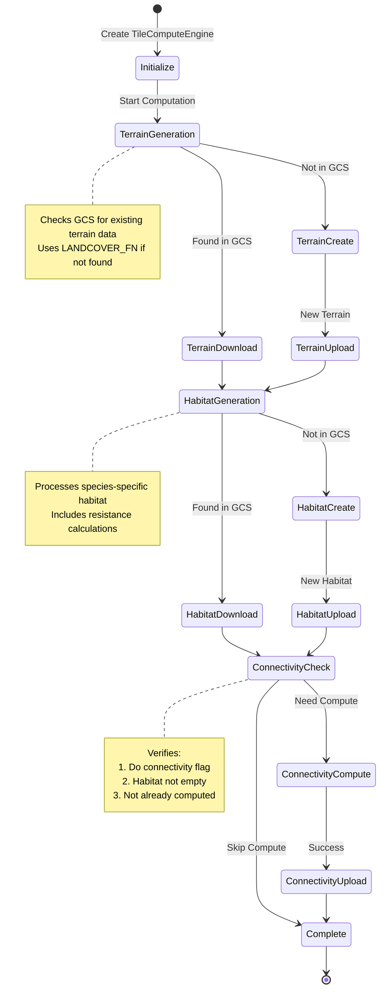

```mermaid
    stateDiagram-v2
    [*] --> Initialize: Create TileComputeEngine
    Initialize --> TerrainGeneration: Start Computation
    
    TerrainGeneration --> TerrainDownload: Found in GCS
    TerrainGeneration --> TerrainCreate: Not in GCS
    TerrainCreate --> TerrainUpload: New Terrain
    
    TerrainDownload --> HabitatGeneration
    TerrainUpload --> HabitatGeneration
    
    HabitatGeneration --> HabitatDownload: Found in GCS
    HabitatGeneration --> HabitatCreate: Not in GCS
    HabitatCreate --> HabitatUpload: New Habitat
    
    HabitatDownload --> ConnectivityCheck
    HabitatUpload --> ConnectivityCheck
    
    ConnectivityCheck --> ConnectivityCompute: Need Compute
    ConnectivityCheck --> Complete: Skip Compute
    
    ConnectivityCompute --> ConnectivityUpload: Success
    ConnectivityUpload --> Complete
    
    Complete --> [*]

    note right of TerrainGeneration
        Checks GCS for existing terrain data
        Uses LANDCOVER_FN if not found
    end note

    note right of HabitatGeneration
        Processes species-specific habitat
        Includes resistance calculations
    end note

    note right of ConnectivityCheck
        Verifies:
        1. Do connectivity flag
        2. Habitat not empty
        3. Not already computed
    end note
```