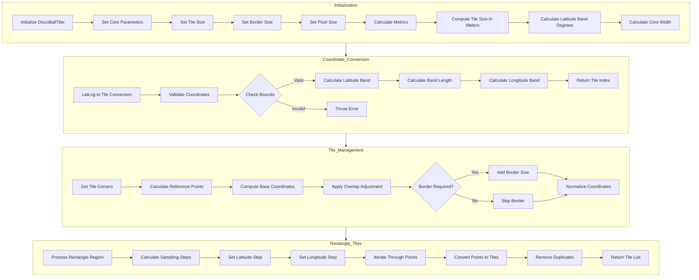

```mermaid
    flowchart TD
    subgraph Initialization
        A[Initialize DiscoBallTiler]
        A --> B1[Set Core Parameters]
        B1 --> B2[Set Tile Size]
        B2 --> B3[Set Border Size]
        B3 --> B4[Set Pixel Size]
        B4 --> C[Calculate Metrics]
        C --> C1[Compute Tile Size in Meters]
        C1 --> C2[Calculate Latitude Band Degrees]
        C2 --> C3[Calculate Core Width]
    end

    subgraph Coordinate_Conversion
        D[LatLng to Tile Conversion]
        D --> E1[Validate Coordinates]
        E1 --> E2{Check Bounds}
        E2 -->|Valid| F1[Calculate Latitude Band]
        E2 -->|Invalid| F2[Throw Error]
        F1 --> F3[Calculate Band Length]
        F3 --> F4[Calculate Longitude Band]
        F4 --> F5[Return Tile Index]
    end

    subgraph Tile_Management
        I[Get Tile Corners]
        I --> J1[Calculate Reference Points]
        J1 --> J2[Compute Base Coordinates]
        J2 --> K1[Apply Overlap Adjustment]
        K1 --> K2{Border Required?}
        K2 -->|Yes| L1[Add Border Size]
        K2 -->|No| L2[Skip Border]
        L1 & L2 --> M[Normalize Coordinates]
    end

    subgraph Rectangle_Tiles
        N[Process Rectangle Region]
        N --> O1[Calculate Sampling Steps]
        O1 --> O2[Set Latitude Step]
        O2 --> O3[Set Longitude Step]
        O3 --> P[Iterate Through Points]
        P --> Q1[Convert Points to Tiles]
        Q1 --> Q2[Remove Duplicates]
        Q2 --> R[Return Tile List]
    end

    Initialization --> Coordinate_Conversion
    Coordinate_Conversion --> Tile_Management
    Tile_Management --> Rectangle_Tiles
```