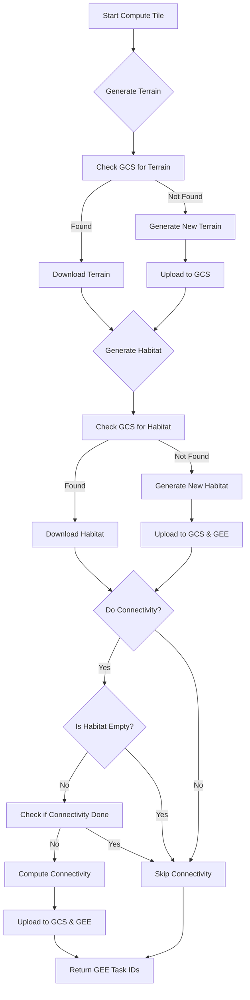

```mermaid
    flowchart TD
    A[Start Compute Tile] --> B{Generate Terrain}
    B --> C[Check GCS for Terrain]
    
    C -->|Found| D[Download Terrain]
    C -->|Not Found| E[Generate New Terrain]
    E --> F[Upload to GCS]
    
    D & F --> G{Generate Habitat}
    G --> H[Check GCS for Habitat]
    
    H -->|Found| I[Download Habitat]
    H -->|Not Found| J[Generate New Habitat]
    J --> K[Upload to GCS & GEE]
    
    I & K --> L{Do Connectivity?}
    L -->|Yes| M{Is Habitat Empty?}
    M -->|No| N[Check if Connectivity Done]
    N -->|No| O[Compute Connectivity]
    O --> P[Upload to GCS & GEE]
    
    M -->|Yes| Q[Skip Connectivity]
    N -->|Yes| Q
    L -->|No| Q
    
    P & Q --> R[Return GEE Task IDs]
```